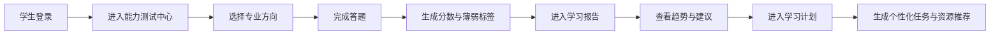
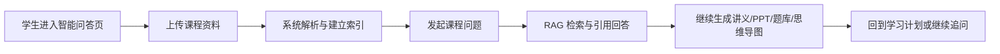
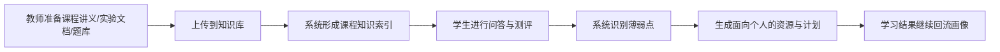

# A3 用户使用路径图

本文档用于补充答辩材料中的“用户使用路径图”，突出系统不是单点功能，而是闭环式学习支持系统。

## 1. 能力测试到学习计划闭环

## 2. 知识库问答到资源生成路径

## 3. 教师材料投喂到学生个性化支持路径

## 4. 答辩使用建议

1. 若 PPT 页数有限，可优先使用第 1 条路径，最能体现“测评 -> 报告 -> 计划”闭环。
2. 若评委追问知识库与反幻觉，可切换第 2 条路径解释“上传 -> 检索 -> 引用回答 -> 继续生成”的链路。
3. 若评委更关注教学落地性，可使用第 3 条路径说明教师与学生如何共用同一系统生态。